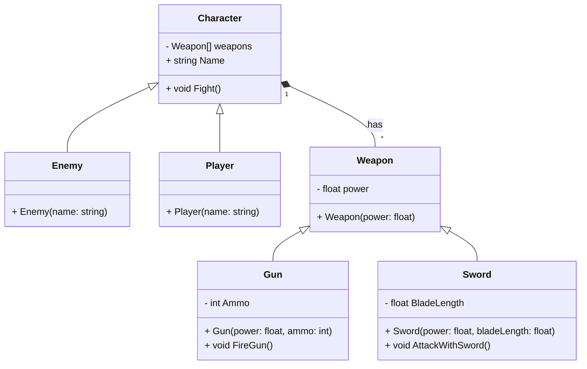

```mermaid 

classDiagram
    class Character {
        - Weapon[] weapons
        + string Name
        + void Fight()
    }

    class Enemy {
        + Enemy(name: string)
    }

    class Player {
        + Player(name: string)
    }

    class Weapon {
        - float power
        + Weapon(power: float)
    }

    class Gun {
        - int Ammo
        + Gun(power: float, ammo: int)
        + void FireGun()
    }

    class Sword {
        - float BladeLength
        + Sword(power: float, bladeLength: float)
        + void AttackWithSword()
    }

    Character <|-- Enemy
    Character <|-- Player
    Character "1" *-- "*" Weapon : has
    Weapon <|-- Gun
    Weapon <|-- Sword
```